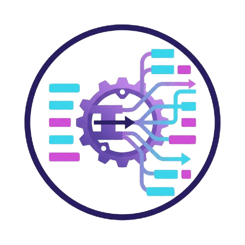

<p align="center">
  <p align="center">
    
  </p>

  <span>
    <h1 align="center">
        bed2gtf
    </h1>
  </span>

  <p align="center">
    <a href="https://img.shields.io/badge/version-2.0.0dev-green" target="_blank">
      
    </a>
    <a href="https://crates.io/crates/bed2gtf" target="_blank">
      
    </a>
    <a href="https://github.com/alejandrogzi/bed2gtf" target="_blank">
      
    </a>
    <a href="https://crates.io/crates/bed2gtf" target="_blank">
      
    </a>
  </p>


  <p align="center">

  </p>

  <p align="center">
    <samp>
        <span>fast and robust BED to GTF/GFF conversion in rust</span>
        <br>
        <br>
        <a href="https://docs.rs/bed2gtf/2.0.0/bed2gtf/">docs</a> .
        <a href="https://github.com/alejandrogzi/bed2gtf?tab=readme-ov-file#Usage">usage</a> .
        <a href="https://github.com/alejandrogzi/bed2gtf?tab=readme-ov-file#Installation">install</a> .
        <a href="https://github.com/alejandrogzi/bed2gtf?tab=readme-ov-file#Conda">conda</a>
    </samp>
  </p>


## Features

- Converts BED to GTF or GFF/GFF3
- Supports `.bed` and `.bed.gz` inputs
- Supports `.gtf`, `.gtf.gz`, `.gff`, `.gff3`, `.gff.gz`, and `.gff3.gz` outputs
- Uses memory-mapped I/O for uncompressed file inputs
- Uses rayon for parallel chunked conversion
- Reads from stdin when `--input` is omitted
- Writes to stdout when `--output` is omitted
- Accepts an optional transcript-to-gene mapping file through `--isoforms`


## Usage

```text
bed2gtf [OPTIONS]

Options:
  -i, --input <BED>         Input BED path; reads stdin when omitted
  -o, --output <OUTPUT>     Output path; writes stdout when omitted
      --to <gtf|gff>        Output format for stdout; required when --output is absent
  -I, --isoforms <TSV>      Optional transcript-to-gene map
  -t, --type <BED_TYPE>     BED layout: 3, 4, 5, 6, 8, 9, 12 [default: 12]
  -T, --threads <N>         Worker threads [default: logical CPU count]
  -c, --chunks <N>          Parallel chunk size [default: 15000]
  -g, --gz                  Gzip stdout or require a .gz output path
  -L, --level <LEVEL>       Log level: error, warn, info, debug, trace [default: info]
  -h, --help                Print help
  -V, --version             Print version
```

## Installation

### Cargo

```bash
cargo install bed2gtf
```

### Build 

1. get rust
2. run `git clone https://github.com/alejandrogzi/bed2gtf.git && cd bed2gtf`
3. run `cargo run --release -- -i <BED> -o <OUTPUT>`

### Container image
to build the development container image:
1. run `git clone https://github.com/alejandrogzi/bed2gtf.git && cd bed2gtf`
2. initialize docker with `start docker` or `systemctl start docker`
3. build the image `docker image build --tag bed2gtf .`
4. run `docker run --rm -v "[dir_where_your_files_are]:/dir" bed2gtf -i /dir/<BED> -o /dir/<OUTPUT>`

### Conda
to use bed2gtf through Conda just:
1. `conda install bed2gtf -c bioconda` or `conda create -n bed2gtf -c bioconda bed2gtf`

### Nextflow
to use bed2gtf through Nextflow as a module just:
1. borrow `main.nf` from [here](https://github.com/alejandrogzi/bed2gtf/blob/master/assets/nf/bed2gtf/main.nf)

## Behavior

- If `--output` is present, the output format is derived from its extension.
- If `--output` is absent, `--to gtf` or `--to gff` is required.
- If the input path is `.bed.gz`, the output must also be gzip-compressed.
- When writing to stdout, gzip output is enabled automatically for gzip input.
- `--gz` is mainly useful for stdout. For file output, the path must end in `.gz` when gzip is requested.

## Isoforms Mapping

`--isoforms` is optional.

When provided, it must point to a two-column tab-separated file:

```text
ENST00000335137	ENSG00000186092
ENST00000423372	ENSG00000237613
```

- Column 1: transcript ID
- Column 2: gene ID

Blank lines and `#` comments are ignored.

## Examples

Convert an uncompressed BED12 file to GTF:

```bash
bed2gtf --input transcripts.bed --output transcripts.gtf
```

Convert a gzip-compressed BED file to gzip-compressed GFF3:

```bash
bed2gtf --input transcripts.bed.gz --output transcripts.gff3.gz
```

Write GTF to stdout:

```bash
bed2gtf --input transcripts.bed --to gtf
```

Read from stdin and write GFF to stdout:

```bash
cat transcripts.bed | bed2gtf --to gff
```

Use a transcript-to-gene mapping file:

```bash
bed2gtf \
  --input transcripts.bed \
  --output transcripts.gtf \
  --isoforms isoforms.tsv
```

Enable debug logging:

```bash
bed2gtf --input transcripts.bed --output transcripts.gtf --level debug
```
